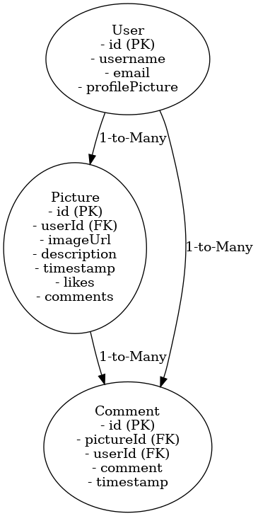

# Project Title

InstaClone

## Overview

InstaClone is a social media web application where users can upload and manage their pictures, like, comment, and view detailed information about each picture, including its description, likes, comments, and the date it was posted.

### Problem Space

Many social media platforms like Instagram offer photo-sharing features but are often filled with cluttered interfaces, unnecessary distractions, and intrusive advertisements. This can overwhelm users who simply want a straightforward platform to share and interact with photos. InstaClone provides a clean, ad-free, and simple experience, focusing entirely on photo-sharing and engagement without the noise.

### User Profile

- Who will use the app?

  - Social media enthusiasts who want a simple and intuitive platform to share their pictures.
  - Users who are frustrated with cluttered or ad-heavy platforms and are looking for a streamlined experience.
  - Individuals who want a quick and easy way to engage with pictures, whether uploading their own or interacting with others.

- How will they use it?

  - Users will upload and delete pictures.
  - Users will view details of a picture, including its description, likes, comments, and the date it was posted.
  - Users will like and comment on pictures.

### Features

- As a user, I want to upload pictures to my gallery.
- As a user, I want to delete pictures from my gallery.
- As a user, I want to view details of each picture, including the picture itself, its description, likes, comments, and the date it was posted.
- As a user, I want to like pictures.
- As a user, I want to comment on pictures.
- As a user, I want to update the description of my uploaded pictures.

## Implementation

### Tech Stack

- Frontend: React (for building the user interface)
- Backend: Node.js with Express (for server-side logic)
- Database: MySQL (to store user data, pictures, likes, and comments)
- Libraries:
  - Frontend Libraries: React Router (for navigation), Axios (for API requests)
  - Backend Libraries: Knex (for MySQL query building)

### APIs

- None required initially; possible future integration for additional features.

### Sitemap

- Home Page:

  - For a single user: Displays a gallery of hardcoded images from "other users".
  - For multiple users (nice-to-have, might be implemented): Dynamically loads posts and comments from the database using Knex and MySQL.

- Profile Page: Displays the user’s uploaded pictures as a gallery, along with some information about the user.
- Picture Details Page: Shows a single picture with its description, likes, comments, and the date it was posted.
- Upload Page: Allows the user to upload a new picture and provide a description.

### Mockups

To be provided.

### Data



### Endpoints

**Get /pictres**

- Retrieve a list of all pictures.

Response:

```
[
  {
    id: 1,
    imageUrl: "https://example.com/image1.jpg",
    description: "A scenic mountain view",
    timestamp: 1700384400000,
    likes: 10,
    comments: [
      { userId: 2, comment: "Amazing!", timestamp: "2024-11-18T10:15:00Z" }
    ]
  },
  {
    id: 2,
    imageUrl: "https://example.com/image2.jpg",
    description: "Delicious homemade pizza",
    timestamp: 1700294400000,
    likes: 8,
    comments: []
  }
]
```

**GET /users/:id**

- Retrieve user information and their uploaded pictures.

Parameters:

- id: The ID of the user (integer).

Response:

```
{
    "id": 1,
    "username": "john_doe",
    "profilePicture": "https://example.com/profile.jpg",
    "pictures": [
        {
            "id": 1,
            "imageUrl": "https://example.com/image1.jpg",
            "description": "My first post!",
            "timestamp": 1700208000000,  // Unix timestamp in milliseconds
            "likes": 5,
            "comments": [
                {
                    "userId": 2,
                    "comment": "Great start!",
                    "timestamp": 1700211600000  // Unix timestamp in milliseconds
                }
            ]
        },
        {
            "id": 2,
            "imageUrl": "https://example.com/image2.jpg",
            "description": "Another great day!",
            "timestamp": 1700294400000,  // Unix timestamp in milliseconds
            "likes": 3,
            "comments": []
        }
    ]
}
```

**POST /pictures**

- Upload a new picture.

Parameters:

- imageUrl: URL of the uploaded picture (string).
- description: Text description of the picture (string).

Response:

```

{
"id": 1,
"imageUrl": "https://example.com/image.jpg",
"description": "A beautiful sunset",
"timestamp": 1700294400000
}

```

**DELETE /pictures/:id**

- Delete a picture.

Parameters:

- id: ID of the picture to delete (integer).

Response:

```

{
"message": "Picture deleted successfully"
}

```

**GET /pictures/:id**

- Get details of a specific picture.

Parameters:

- id: ID of the picture.

Response:

```

{
"id": 1,
"imageUrl": "https://example.com/image.jpg",
"description": "A beautiful sunset",
"timestamp": 1700294400000
"likes": 25,
"comments": [
{
"userId": 2,
"comment": "Amazing shot!",
"timestamp": 1700294400000
},
{
"userId": 3,
"comment": "Wow, love it!",
"timestamp": 1700294400000
}
]
}

```

**PATCH /pictures/:id/like**

- Like a picture.

Parameters:

- id: ID of the picture to like (integer).

Response:

```

{
"id": 1,
"likes": 26
}

```

**POST /pictures/:id/comments**

- Add a comment to a picture.
  Parameters:

- id: ID of the picture to comment on (integer).
- comment: Text content of the comment (string).

Response:

```

{
"id": 1,
"comments": [
{
"userId": 2,
"comment": "Amazing shot!",
"timestamp": 1700294400000
},
{
"userId": 3,
"comment": "Wow, love it!",
"timestamp": 1700294400000
},
{
"userId": 4,
"comment": "This is breathtaking!",
"timestamp": 1700294400000
}
]
}

```

## Roadmap

- Create Client

  - Set up a React project with routes and boilerplate pages.

- Create Server

  - Set up an Express project with routing and placeholder 200 responses.

- Create Migrations

  - Define database schemas for User, Picture, and Comment tables.

- Gather Sample Data

  - Prepare a set of sample hardcoded posts for single-user functionality.

- Deploy Client and Server

  - Deploy the frontend (e.g., Netlify) and backend (e.g., Heroku) so all commits are reflected in production.

- Feature: Home Page

  - Implement the Home Page with hardcoded images
  - Create GET /pictures endpoint for fetching pictures (single-user functionality).

- Feature: Profile Page

  - Implement the Profile Page to display the user's uploaded pictures.
  - Create GET /users/:id endpoint for user profile and pictures.

- Feature: Picture Upload

  - Implement the Upload Page to allow the user to upload pictures with descriptions.
  - Create POST /pictures endpoint for uploading pictures.

- Feature: Picture Details Page

  - Implement the Picture Details Page to show a picture’s description, likes, comments, and timestamps.
  - Create GET /pictures/:id endpoint to fetch picture details.

- Feature: Like Picture

  - Add functionality to like pictures from the details page.
  - Create PATCH /pictures/:id/like endpoint for liking pictures.

- Feature: Comment on Picture

  - Add functionality to comment on pictures from the details page.
  - Create POST /pictures/:id/comment endpoint for adding comments.

- Feature: Delete Picture

  - Add functionality for users to delete their pictures.
  - Create DELETE /pictures/:id endpoint to delete pictures.

- Bug Fixes

  - Test all features to ensure functionality and fix any bugs.

- Final Touches

  - Finalize README with diagrams, mockups, and endpoint details.
  - Prepare the app for Demo Day.

- DEMO DAY

## Future Implementations

- Multiple Users:

  - Dynamically load posts, comments, and user-specific data using Knex and MySQL.

- Authentication:

  - Implement login and registration functionality using JWT authentication.
    Protect routes and ensure only logged-in users can perform actions like uploading, liking, or commenting on pictures.

- Search and Filtering:

  - Add search functionality to allow users to find pictures by description or tags.
    Implement filters to sort pictures by date, popularity, or specific users.

- Enhanced User Profiles:

  - Allow users to update their profile information, including bio and profile picture. Display additional statistics on profiles, such as total likes and comments received.

- Notifications:

  - Notify users when their pictures are liked or commented on.

- Social Features:

  - Enable following other users and viewing a feed of their uploaded pictures.
